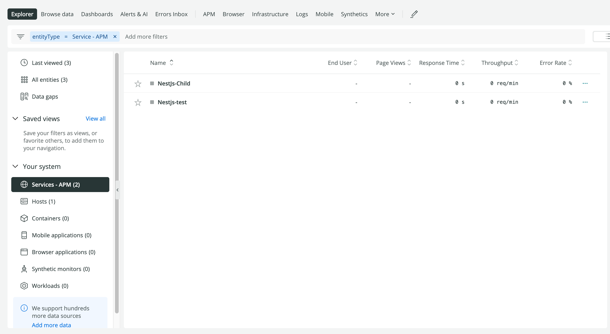
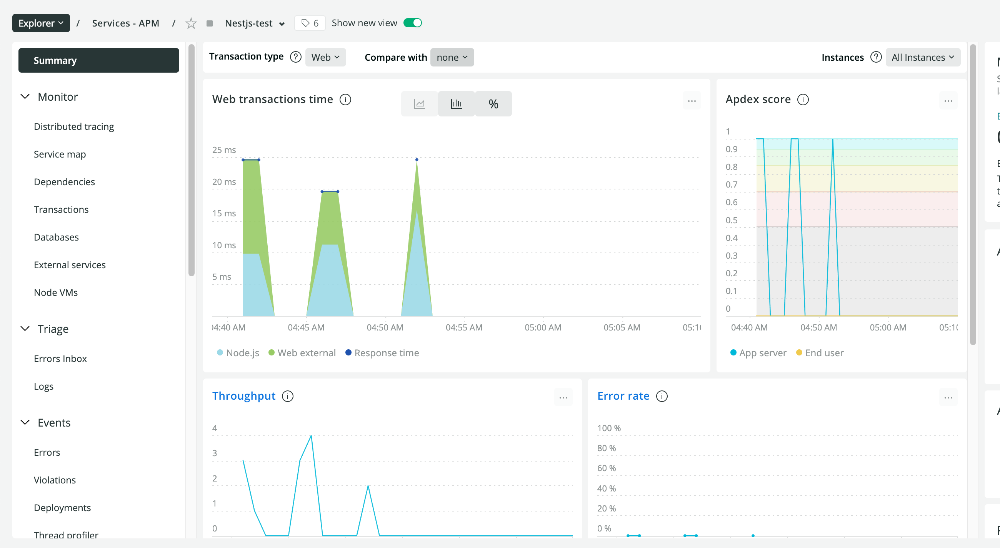
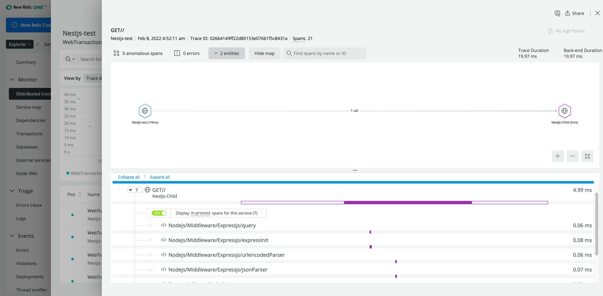

# How to run this example
```bash
# Install dependencies 
cd child
npm install
cd ..
cd parent
npm install
cd ..

# Edit newrelic.ts file under child/src and parent/src and place your own newrelic license keys


# Run the child
cd child
npm run start
# Open browser on http://localhost:3001


# Run the parent in a new terminal
cd parent
npm run start
# Open browser on http://localhost:3000

# Login to newrelic one and you should now see two apps under APM
```



